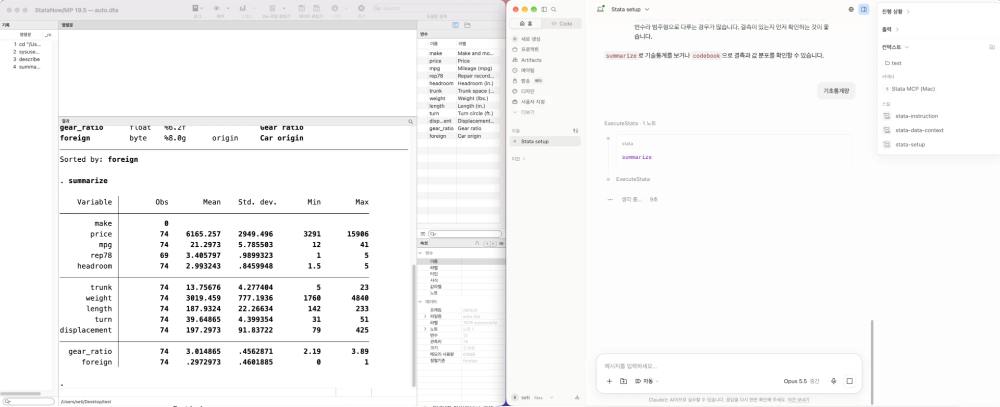
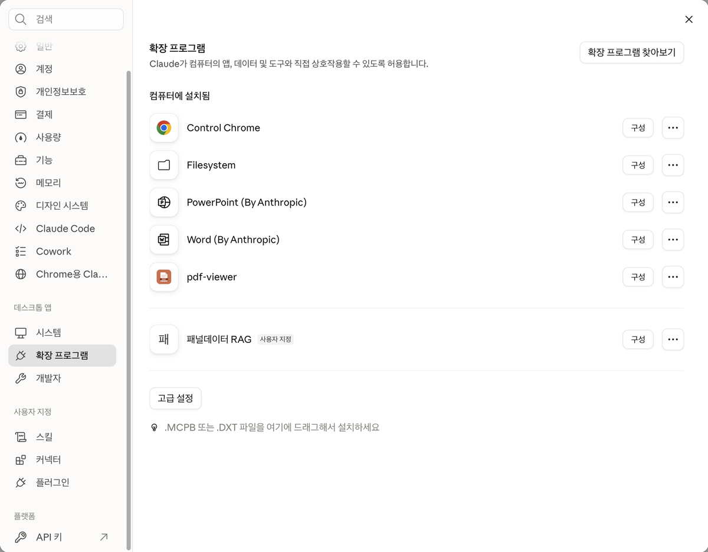
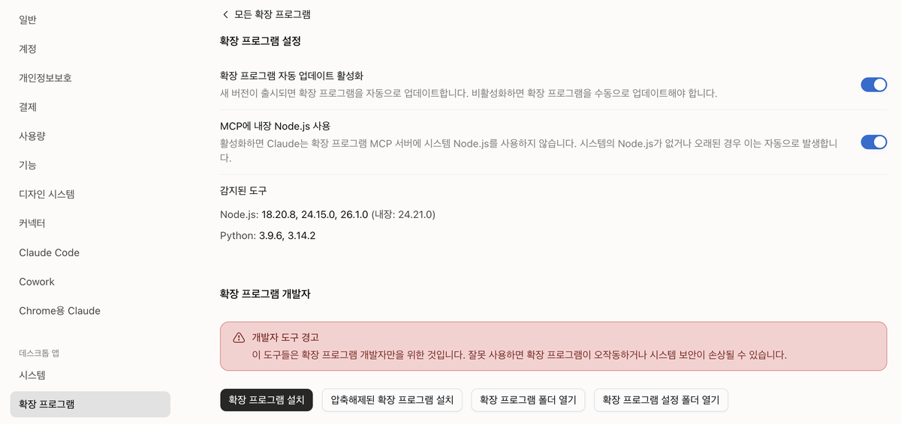
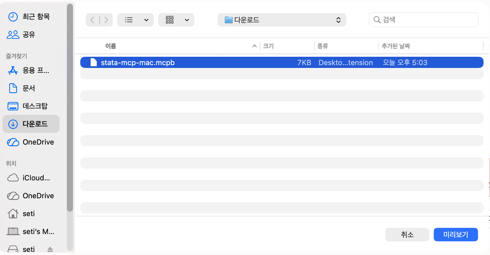
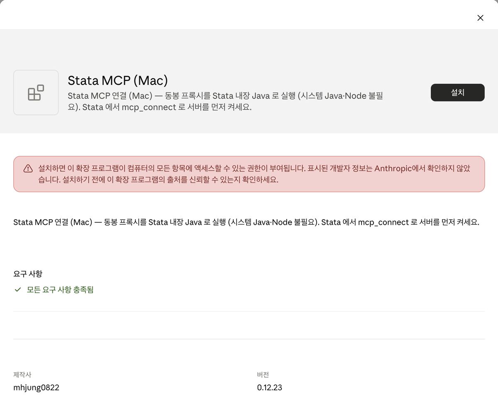
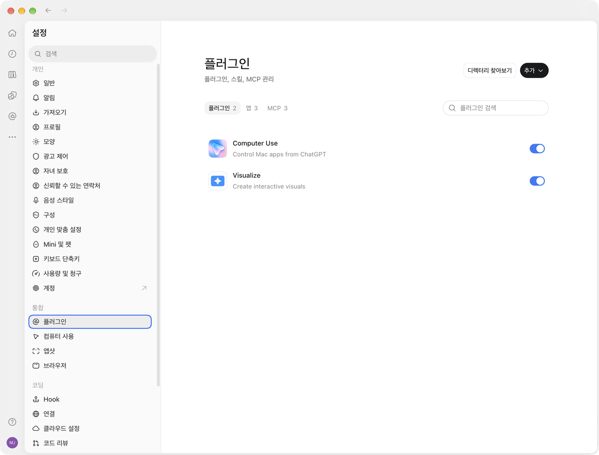
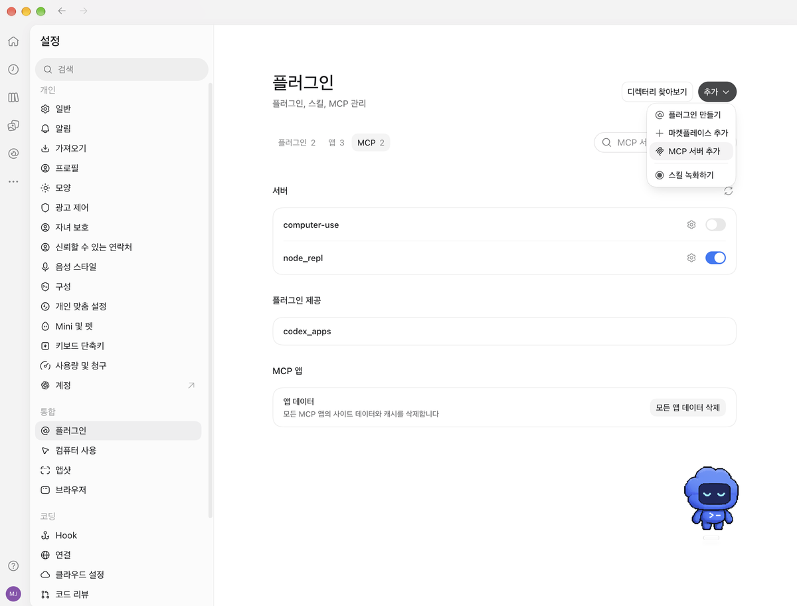
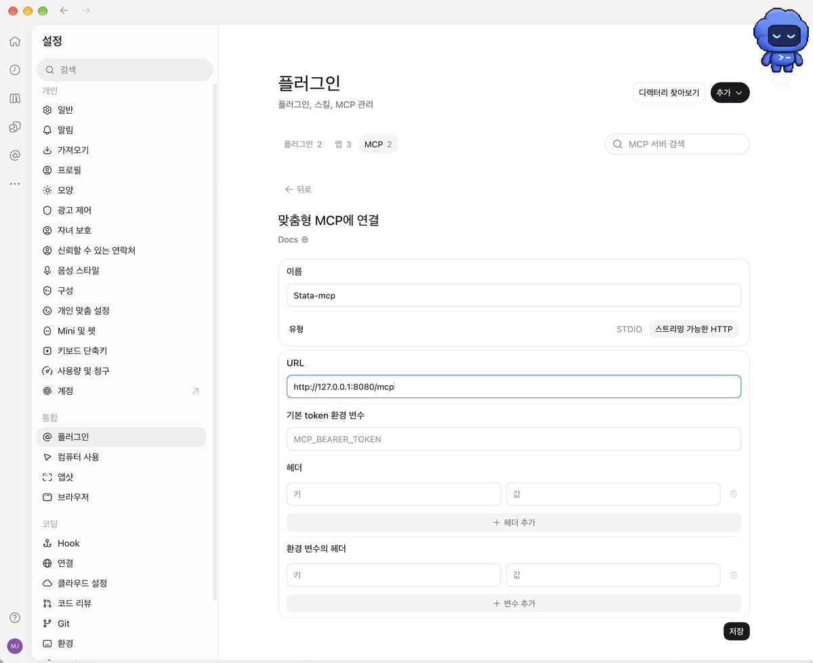

# Stata MCP — Stata × Claude · ChatGPT

> 한국어: [README.md](README.md)

Stata MCP lets Claude and ChatGPT **work with you in Stata (Results window, Data Browser, graphs, and so on), on the same data**. You **exchange analysis commands and results** back and forth: ask for an analysis in chat and it runs right in your Stata, or send results you ran yourself in Stata to the AI to interpret and carry on from there. While connected, you can still use Stata on your own as usual and bring in the AI only when you need it.

[](https://youtu.be/bvUdS-awp6s)

▶ [Watch the demo video (YouTube)](https://youtu.be/bvUdS-awp6s)

Installation is three steps: **① Stata-side install → ② Start the server → ③ Register in Claude (extension + skills)**.
You can also connect from the ChatGPT desktop app — see section 6.

For usage and troubleshooting after install see [USAGE.en.md](USAGE.en.md).

---

## 1. Prerequisites

| Item | Version |
|------|------|
| Stata | 17+ (19 recommended) |
| Claude Desktop | latest — [download](https://claude.ai/download) |

---

## 2. Stata-side install

One line in Stata:

```stata
net install stata-mcp, from("https://raw.githubusercontent.com/mhjung0822/stata_mcp-releases/main/release") replace
```

This downloads the two jars plus the ado/dlg files. That is the whole install — the help DB (~32MB) is offered by `mcp_connect` (next section) on first connect (answer y; internet connection required).

To update later:

```stata
adoupdate stata-mcp, update
mcp_setup, updatedb
```

- `mcp_setup, updatedb` — refreshes the help DB too (same as the control panel's [Update help DB] button)

> To apply an update, **restart Stata** and reconnect with `mcp_connect`.

> The Claude extension (`.mcpb`) is updated separately. When a new version is out, download the file again from section 4-1 and install it the same way.

> To change the ports (default 8080/8001), edit `BRIDGE_PORT`/`DRONE_PORT` in `stata_mcp.properties` next to the jar — the file is created automatically on first start.

---

## 3. Start the server

```stata
mcp_connect
```

Starts the MCP server and the drone in one go. On first run it offers the help-DB download — type `y` (recommended).

> The server shuts down automatically when you quit Stata. You can also start it from the GUI control panel (`db mcp`) — see [USAGE.en.md](USAGE.en.md).

> ⚠️ **If `mcp_connect` says Java 17 or later is required, or a red `java.lang.UnsupportedClassVersionError` appears and the drone won't start** — Stata's bundled Java is outdated. Run `update all` in Stata, **restart Stata**, then run `mcp_connect` again. Details in the troubleshooting section of [USAGE.en.md](USAGE.en.md).

---

## 4. Register in Claude (cowork)

> For environment issues such as cowork not activating on Windows, see [TROUBLESHOOTING.md](TROUBLESHOOTING.md) (Korean).

### 4-1. Install the extension (MCP connection)

1. Download the **one** file matching your OS:
   - Mac: [`stata-mcp-mac.mcpb`](https://raw.githubusercontent.com/mhjung0822/stata_mcp-releases/main/claude-plugins/stata-mcp-mac.mcpb)
   - Windows: [`stata-mcp-win.mcpb`](https://raw.githubusercontent.com/mhjung0822/stata_mcp-releases/main/claude-plugins/stata-mcp-win.mcpb)
     - If it will not install, or the tools do not appear, install [`stata-mcp-win-java.mcpb`](https://raw.githubusercontent.com/mhjung0822/stata_mcp-releases/main/claude-plugins/stata-mcp-win-java.mcpb) instead. Do not install both at the same time.
2. In Claude Desktop, click your **name** at the bottom left → **Settings** → open **Desktop app → Extensions** in the left list.

   

3. **Drag** the downloaded `.mcpb` file onto this screen. If drag-and-drop does not work, click **Advanced settings** at the bottom → **Install Extension**, select the downloaded file, and confirm (on Mac the button may read **Preview**).

   

   

4. In the confirmation dialog, check that the name is **Stata MCP (Mac)** (Windows: **Stata MCP (Windows)**) and click **Install** at the top right.

   

5. Restart Claude Desktop

> Screenshots are from the Korean UI on Mac; button positions are the same. The server from step 3 (`mcp_connect`) must be running for the tools to work. To update, install the new `.mcpb` file the same way.

### 4-2. Register the skills (slash commands)

1. [Download `stata-skills-all-en.zip`](https://raw.githubusercontent.com/mhjung0822/stata_mcp-releases/main/claude-plugins/stata-skills-all-en.zip) (individual skills: `claude-plugins/skill-zips-en/`)
2. **Unzip it** — you get 11 per-skill zips
3. Claude Desktop → **Settings → Skills** → Upload → upload the extracted **per-skill zips** (do not upload the bundle zip itself)
4. Upload once and it applies automatically to every device on the same account

> A Korean edition also exists (`stata-skills-all.zip`). The skills share names across the two packs, so install only one language pack per account.

For the skill lineup and usage, see [USAGE.en.md](USAGE.en.md).

---

## 5. Connection test

Start with both Stata and Claude Desktop **fully quit** — closing the Claude window
leaves it running in the background, so quit via the tray icon → **Quit** on Windows,
or **⌘Q** on Mac. Then start them in this order:

```
1. Start Stata → run mcp_connect
2. Start Claude Desktop
```

Then, in a new chat (or cowork session):

```
What Stata version am I running?
```

If the version and edition come back (e.g. StataNow/MP 19.5), the installation is complete.

If not, check in order:

1. Stata Results window — does the `mcp_connect` output say `Ready for commands`? (if not, see step 3, Start the server)
2. Claude tools list — is the Stata MCP extension visible? (if not, fully quit and relaunch Claude Desktop)

For everyday usage see [USAGE.en.md](USAGE.en.md) — startup order, control panel, push notifications, help lookup, troubleshooting. Rare environment issues: [TROUBLESHOOTING.md](TROUBLESHOOTING.md) (Korean).

---

## 6. Connect from the ChatGPT desktop app (optional)

Instead of Claude, you can connect the ChatGPT desktop app to the same Stata. No extension file is needed — you only register an address.

1. In the ChatGPT desktop app, click your **profile** at the bottom left → **Settings** → open **Integrations → Plugins** in the left list.

   

2. Open the **MCP** tab at the top, then click **Add** (top right) → **Add MCP server**.

   

3. Fill in the form as below and click **Save** at the bottom right.
   - **Name**: `Stata-mcp` (any name is fine)
   - **Type**: select **Streamable HTTP**
   - **URL**: `http://127.0.0.1:8080/mcp`
   - Leave the bearer token, headers, and env-var headers fields **empty**

   

4. In a new chat, type `What Stata version am I running?` — if the version comes back, you are connected.

> Screenshots are from the Korean UI on Mac; button positions are the same. The server from step 3 (`mcp_connect`) must be running for the tools to work. If you changed the port (see section 2), use that port instead of `8080` in the URL. The skill pack in 4-2 is for Claude.


---

## License

Copyright (c) 2026 [JasonTG, Inc.](https://www.jat.co.kr/) and mhjung0822
